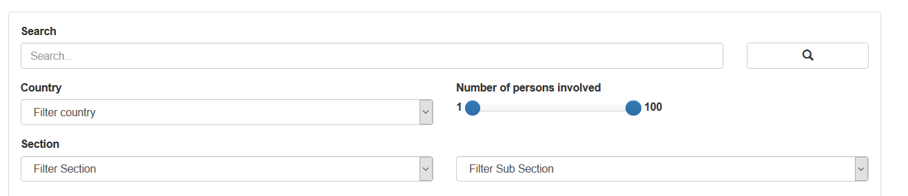
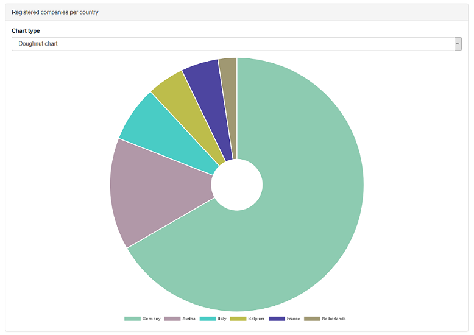
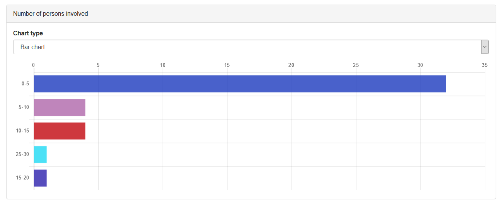
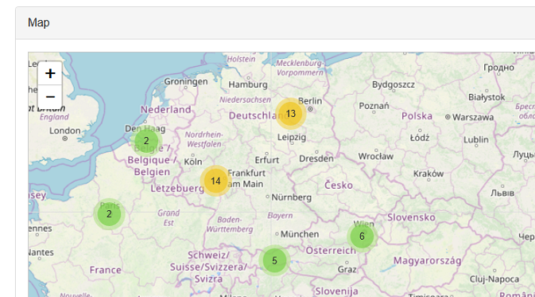
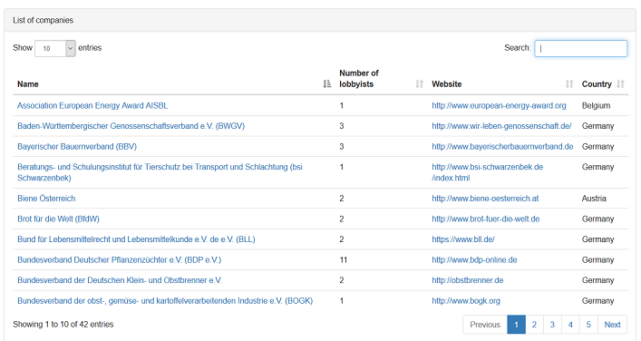
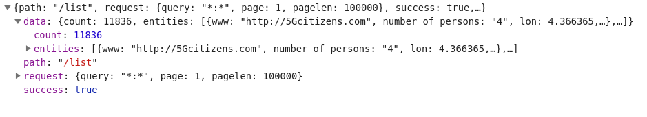
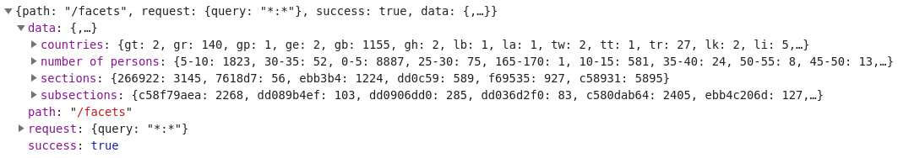

# Project: Lobby Register

Web application to analyze the [EU transarency register](https://data.europa.eu/euodp/en/data/dataset/transparency-register)

## Overview

This application aims to visualize the publicly available data about which individuals, groups and companies are involved in lobbying and influencing lawmaking in the European Union. It also offers basic filtering and search functionality to help information retrieval.
The transparency register is published biannually in XLS and XML format. It consists of around 12.000 entries. Each entry contains address and contact information, legal status, fields of interest, degree of involvement, monetary and personnel expenses and the laws and drafts that are worked on.
This information is parsed, categorized and enhanced with geolocation references by the server process before being presented by the client.

## Filtering Options



By default, the app will return all datasets. The main filtering option is a text search - each substring (separated by spaces) will be searched for in all text fields of the data, such as the name and the goal description.
Beyond this, entries can be filtered by country of registration (select one), amount of employed lobbyists and registration date (select lower and upper bound) and the type of the organization (select a section and optionally a subsection).

## Viualiszation

### Charts
Aspects that amount to dividing the data up into general classifications, like which countries the organizations are based in, which section they belong to and roughly how many people are involved, will be represented by doughnut charts and horizontal bar charts. There is an setting to switch between those two options.
The Doughnot charts are responsive, it is possible to hide slices of it by clicking on them - both in the diagram itself and the key - which will cause the other slices to be resized to match the percentage they represent with the hidden one excluded.




The distribution of organizations by registration date is represented by a histogram.

### Map

The geographical distribution of the organization's address is shown by overlaying an OpenStreeMap world map with dots representing each company, automatically clustering groups that would be in close proximity to each other with the current zoom setting. Clicking on a cluster will zoom in on it, clicking on a single organization's marker will bring up information about it.



If possible, the OSM Nominatim API is used to map addresses to geolocations. Adresses that could not be located this way will be passed to the Google Geocode API instead.

### List

At the bottom of the page, the data is also presented by a separate paged list that can be filtered and sorted on the fly. Its entries will also link to a more in-deptth description of the stated goals of the organization.



## Server API

- ``/list`` - this is the interface for getting the complete datasets in a paginated manner. Supported parameters:
    - ``query`` (default value: "\*:\*"): Search terms for filtering the results
    - ``page`` (default value: 1): Returned page of the results.
    - ``pagelen`` (default value: 10): Amount of results per page.




- ``/facets``- this is the interface for getting the amounts of results matching various classifications. Supported parameters:
    - ``query`` (default value: "\*:\*"): Search terms for filtering the results



The ``query`` parameters expect inputs in the format of Whoosh's query language.

## Installing

### Technical Requirements
- Python 2.7 + PIP
- Unix (shell script support and utility commands)
- Setup:
    - ```pip install Whoosh```
    - ```pip install requests```

### Quickstart

- ```./cmd.py lib.parser.create_index```
- ```./service.sh start```

## Commands

- Start service: ```./service.sh start```
    - Optional with port: ```./service.sh start 8001```
    - Optional with output in terminal: ```./service.sh 8001 output```
- End service: ```./service.sh stop```
    - Optional with port: ```./service.sh stop 8001```
- Create index 
    - Import csv: ```./cmd.py lib.parser.import_csv```
        - Optional with csv file path: ```./cmd.py lib.parser.import_csv data/source/full_export_new.csv```
    - Add geo reference ```./cmd.py lib.parser.add_geo_reference```
    - Create search index: ```./cmd.py lib.parser.create_index```

## Description of the source data

- Additional information may be found here: [lobbypedia.de](https://lobbypedia.de/wiki/Lobbyregister_EU) (German)
- Fields of interest:
    - organisation_name
    - registration_date
    - website_address
    - level_of_interest
    - number_of_persons_involved
    - number_of_ep_accredited_persons
    - full_time_equivalent_fte
    - overall_budget_turnover_absolute_amount
    - overall_budget_turnover_as_a_range
    - estimate_of_costs_absolute_amount
    - estimate_of_costs_as_a_range
    - member_organisations
    - fields_of_interest
    - eu_initiatives
    - section
    - subsection
    - head_office
        - head_office_address
        - head_office_post_code
        - head_office_country
        - head_office_city

- Example data set:
```
{
  "member_organisations": "",
  "identification_number": "000243429028-82",
  "fields_of_interest": "Transport",
  "head_office_address": "via alberto bergamini 50",
  "full_time_equivalent_fte": "0,25",
  "person_with_legal_responsibility": "Gabriele Benedetto",
  "inter_groups": "",
  "financial_year_start_date": "01/01/2016",
  "grants": "",
  "head_office_country": "Italy",
  "eu_initiatives": "Road & mobility Package: Direttiva Europea Telepedaggio e relativa Decisione. Cooperative its , eurovignette",
  "organisation_name": "Telepass S.p.a (TLP)",
  "belgium_office_post_code": "",
  "number_of_persons_involved": "1",
  "procurement": "",
  "section": "II - In-house lobbyists and trade/business/professional associations",
  "source": "",
  "belgium_office_address": "",
  "subsection": "Other organisations",
  "belgium_office_phone": "",
  "number_of_ep_accredited_persons": "",
  "overall_budget_turnover_as_a_range": "",
  "belgium_office_city": "",
  "persons_accredited_for_access_to_european_parliament_premises": "",
  "estimate_of_costs_absolute_amount": "",
  "registration_date": "20/11/2017",
  "website_address": "http://telepass.com",
  "commission_expert_groups_and_other_similar_entities_european_commission": "NA",
  "head_office_post_box": "",
  "head_office_city": "roma",
  "membership": "",
  "head_office_post_code": "",
  "goals__remit": "Commercializzazione servizi di pagamento del pedaggio e della mobilit\\u00e0 legata al veicolo e alla persona",
  "industry_forums": "",
  "head_office_phone": "(+39)0643632670",
  "level_of_interest": "European",
  "relevant_communication": "",
  "financial_year_end_date": "01/12/2016",
  "estimate_of_costs_as_a_range": "0-9999",
  "overall_budget_turnover_absolute_amount": "0",
  "legal_status": "S.p.A",
  "person_in_charge_of_eu_relations": "Gabriele Benedetto",
  "customers": "",
  "belgium_office_post_box": "",
  "position": "Amministratore Delegato"
}
```
