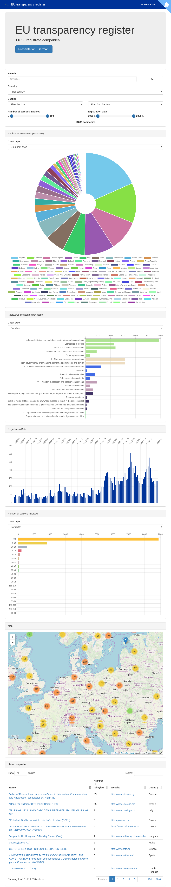

# Project: Lobby Register

Web application to analyse the [EU transarency register](https://data.europa.eu/euodp/en/data/dataset/transparency-register)



## Overview

This application aims to visualize the publicly available data about which individuals, groups and companies are involved in lobbying and influencing lawmaking in the European Union. It also offers basic filtering and search functionality to help information retrieval.
The transparency register is published biannually in XLS and XML format. It consists of around 12.000 entries. Each entry contains address and contact information, legal status, fields of interest, degree of involvement, monetary and personnel expenses and the laws and drafts that are worked on.
This information is parsed, categorized and enhanced with geolocation references by the server process before being presented by the client.

## Installing

### Technical Requirements
- Python 2.7 +  PIP
- Unix (shell script support and utility commands)
- Setup:
```pip install Whoosh```
```pip install requests```

### Quickstart

- ```./cmd.py lib.parser.create_index```
- ```./service.sh start```

## Commands

- start service: ```./service.sh start```
    - optional with port: ```./service.sh start 8001```
    - optional with output in terminal: ```./service.sh 8001 output```
- end service: ```./service.sh stop```
    - optional with port: ```./service.sh stop 8001```
- create index 
    - import csv: ```./cmd.py lib.parser.import_csv```
        - optional with csv file path: ```./cmd.py lib.parser.import_csv data/source/full_export_new.csv```
    - add geo reference ```./cmd.py lib.parser.add_geo_reference```
    - create search index: ```./cmd.py lib.parser.create_index```

## Geo Locations

- Felder:
    - head_office_address
    - head_office_post_code
    - head_office_country
    - head_office_city
- erster Druchlauf: OSM nominatim api, 7021 gefundene Geo-Referenzen, 4815 unzugeordnete
- zweiter Durchlauf: google geocode api, 7 von 4815 Adressen ohne Koordinaten
- dritter durchlauf: 7 Adressen manuell zugeordnet
    - Probleme: Länder, wie "Palestinian Occupied Territory"

## Daten

- Infos: [lobbypedia.de](https://lobbypedia.de/wiki/Lobbyregister_EU)
- Felder von Interesse:
    - organisation_name
    - registration_date
    - website_address
    - level_of_interest
    - number_of_persons_involved
    - number_of_ep_accredited_persons
    - full_time_equivalent_fte
    - overall_budget_turnover_absolute_amount
    - overall_budget_turnover_as_a_range
    - estimate_of_costs_absolute_amount
    - estimate_of_costs_as_a_range
    - member_organisations
    - fields_of_interest
    - eu_initiatives
    - section
    - subsection
    - head_office
        - head_office_address
        - head_office_post_code
        - head_office_country
        - head_office_city
