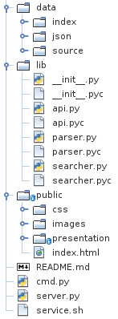
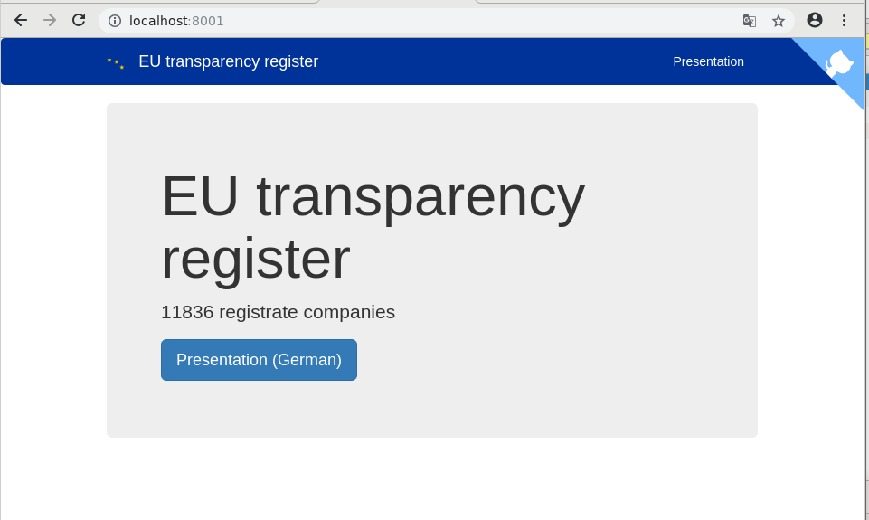

<!-- .slide: data-layout="main" -->
###  Gruppe 4
# EU Lobby Register

     
13.02.2019 Leipzig

Falk Müller, Tobias Mann

--------------------------------------------------------------------------------

## Inhalt

1. Daten
2. Architektur
3. Aufbereitung der Daten
4. Frontend
5. Services

--------------------------------------------------------------------------------
<!-- .slide: style="font-size: 0.8em;" -->

## 1. Daten

- [data.europa.eu](https://data.europa.eu/euodp/en/data/dataset/transparency-register)
- seit 2015
- ~ 12.000 Einträge
- 54 Attribute je Eintrag

### Angaben

- allgemeine Angaben (Adresse, rechtlicher Status, etc.)
- Interessen und Tätigkeiten des Akteurs
- die Organisationen und/oder Einzelpersonen, in deren Auftrag der Akteur agiert
- Teilnahme an EU-Strukturen und Plattformen (Ausschüsse, Foren)
- Geld- und Personalaufwand für diese Tätigkeiten
- Gesetze und Vorlagen, an denen der Akteur arbeitet

--------------------------------------------------------------------------------
<!-- .slide: style="font-size: 0.5em;" -->

## 1. Daten
```
{
  "member_organisations": "",
  "identification_number": "000243429028-82",
  "fields_of_interest": "Transport",
  "head_office_address": "via alberto bergamini 50",
  "full_time_equivalent_fte": "0,25",
  "person_with_legal_responsibility": "Gabriele Benedetto",
  "inter_groups": "",
  "financial_year_start_date": "01/01/2016",
  "grants": "",
  "head_office_country": "Italy",
  "eu_initiatives": "Road & mobility Package: Direttiva Europea Telepedaggio e relativa Decisione. Cooperative its , eurovignette",
  "organisation_name": "Telepass S.p.a (TLP)",
  "belgium_office_post_code": "",
  "number_of_persons_involved": "1",
  "procurement": "",
  "section": "II - In-house lobbyists and trade/business/professional associations",
  "source": "",
  "belgium_office_address": "",
  "subsection": "Other organisations",
  "belgium_office_phone": "",
  "number_of_ep_accredited_persons": "",
  "overall_budget_turnover_as_a_range": "",
  "belgium_office_city": "",
  "persons_accredited_for_access_to_european_parliament_premises": "",
  "estimate_of_costs_absolute_amount": "",
  "registration_date": "20/11/2017",
  "website_address": "http://telepass.com",
  "commission_expert_groups_and_other_similar_entities_european_commission": "NA",
  "head_office_post_box": "",
  "head_office_city": "roma",
  "membership": "",
  "head_office_post_code": "",
  "goals__remit": "Commercializzazione servizi di pagamento del pedaggio e della mobilit\\u00e0 legata al veicolo e alla persona",
  "industry_forums": "",
  "head_office_phone": "(+39)0643632670",
  "level_of_interest": "European",
  "relevant_communication": "",
  "financial_year_end_date": "01/12/2016",
  "estimate_of_costs_as_a_range": "0-9999",
  "overall_budget_turnover_absolute_amount": "0",
  "legal_status": "S.p.A",
  "person_in_charge_of_eu_relations": "Gabriele Benedetto",
  "customers": "",
  "belgium_office_post_box": "",
  "position": "Amministratore Delegato"
}
```
--------------------------------------------------------------------------------

## 2. Architektur

<!-- .element: style="height: 530px;" -->

--------------------------------------------------------------------------------
<!-- .slide: style="font-size: 0.8em;" -->

## 3. Aufbereitung der Daten

### Koordinaten

- OSM nominatim Api
    - 7021 gefundene Geo-Referenzen
    - 4815 unzugeordnete
- Google geocode Api: 
    - 7 von 4815 Adressen ohne Koordinaten
- manueller Durchlauf: 
    - 7 Adressen manuell zugeordnet
    - Probleme: Länder, wie "Palestinian Occupied Territory"

--------------------------------------------------------------------------------
<!-- .slide: style="font-size: 0.8em;" -->

## 3. Aufbereitung der Daten

### Facetten

- Gruppierung der Sektionen
    - mit Untersectionen
    - Vergabe von Ids
- Erstellung von Länderliste zu Iso-Codes

--------------------------------------------------------------------------------

## 4. Frontend



--------------------------------------------------------------------------------

## 5. Services

**/list**
- query: Suchanfrage (default: "*:*")
- page: Seite (default: 1)
- pagelen: Anzahl Einträge je Seite (default: 10)


--------------------------------------------------------------------------------

## 5. Services

**/facets**
 - query: Suchanfrage (default: "*:*")


--------------------------------------------------------------------------------
<!-- .slide: style="font-size: 0.9em;" -->

## 5. Services

### Query Language

[Whoosh Syntax](https://whoosh.readthedocs.io/en/latest/parsing.html)

- country_code_k:de AND number_of_persons_involved_i:[10 to 100]
- magic data types
    - _i integer
    - _s string
    - _f float
    - _b boolean
    - _k Keyword

--------------------------------------------------------------------------------

## Quellen

- [data.europa.eu](https://data.europa.eu/euodp/en/data/dataset/transparency-register)
- [lobbypedia.de](https://lobbypedia.de/wiki/Lobbyregister_EU)


--------------------------------------------------------------------------------

## Vielen Dank für Ihre Aufmerksamkeit


[Druck-Version](?print-pdf)

<!-- .element: style="width: 400px;" -->
